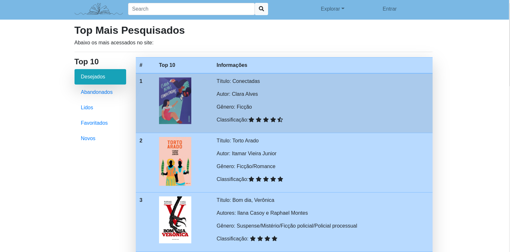

# Dev-Web
<h2>Trabalho 3_ Descrição: </h2>

 Páginas criadas utilizando as seguintes linguagens de marcação:

	
<ul class="mt-3">
    <li>HTML</li>
	<li>CSS</li>
</ul>

 A proposta do projeto é desenvolver páginas responsivas apresentando como foco o framework <strong>Bootstrap</strong>.

O tema escolhido para as páginas foi divulgação de autores brasileiros. A fonte de inspiração para o trabalho foi o <a href="https://www.skoob.com.br/">skoob.</a>

 🛠 Segue abaixo os componentes utilizados:

<ul class="mt-3">
	<li>Alerts</li>
	<li>Badges</li>
	<li>Button</li>
	<li>Cards</li>
    <li>Carousel</li>
    <li>Forms</li>
    <li>Footer</li>
    <li>List group</li>
    <li>Modal</li>
    <li>Navbar</li>
	<li>Navs and tabs</li>
	<li>Offcanvas</li>
	<li>Progress</li>
	<li>Tables</li>
</ul>

Abaixo segue os resultados: 

<h5> Gostou? Deixe o seu like :stuck_out_tongue_winking_eye: </h5>

	
