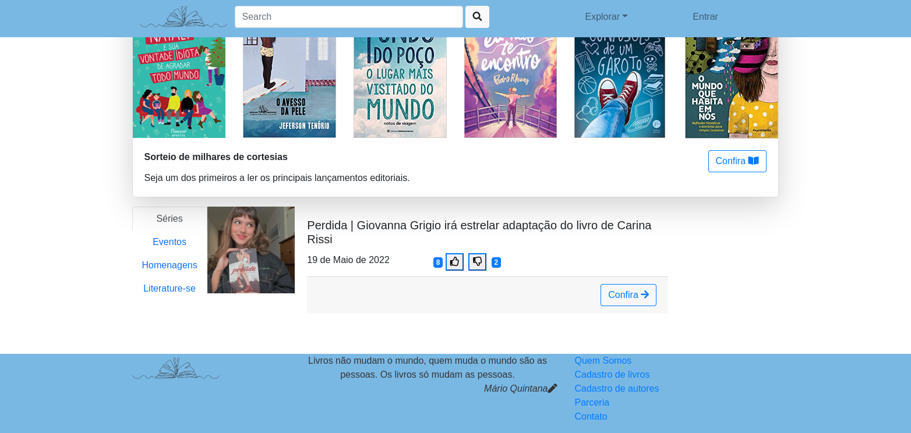

# Dev-Web
<h2>Trabalho 2_ Descrição: </h2>

 Páginas criadas utilizando as seguintes linguagens :

	
<ul class="mt-3">
    <li>HTML</li>
	<li>CSS</li>
	<li>JavaScript</li>
</ul>

 A proposta do trabalho 2 é desenvolver uma página responsiva usando como conteúdo cards implementados somente utilizando JavaScript. 
O trabalho também apresenta como foco o uso do webpack, acrescentando no arquivo de configuração do projeto o processo de transpilação
e acrescendo aos bundles o bootstrap.

O tema para o desenvolvimento da página se manteve: divulgação de autores brasileiros. A fonte de inspiração para o trabalho foi o <a href="https://www.skoob.com.br/">skoob.</a>

<h4>Como rodar o projeto? </h4>
	<ol class="mt-3">
		<li> Installe o NodeJs</li>
		<li>Utilize o comando "npm run build"</li>
		<li>Utilize o comando "npm run start"</li>
	</ol>
		

Abaixo segue o resultado: 

	
